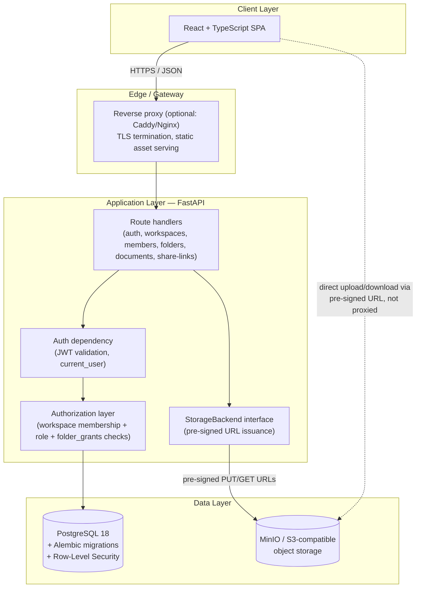

# 03 — Architecture

## Diagram

## Layer explanations

**Client layer (React + TypeScript).** A single-page app: login/signup, workspace switcher, folder browser, upload flow, member/role management, and the "share" dialog. Talks to the API only over JSON; never talks to Postgres or MinIO directly except when using a pre-signed URL it was handed by the API (the browser still never sees storage credentials).

**Edge / gateway.** TLS termination and static file serving for the built frontend. Optional in local dev (Vite's dev server + FastAPI's CORS handling covers it), present in any real deployment.

**Application layer (FastAPI).** Split into three concerns that stay decoupled on purpose:
- *Auth dependency* — validates the JWT on every protected request and resolves `current_user`. This is the only place a request's identity is established.
- *Authorization layer* — a shared dependency, not duplicated per-route, that answers "does `current_user` have the right relationship to this `workspace_id`/`document_id`/`folder_id`?" by checking `workspace_members` (role) and, for Guests, `folder_grants`. Every document/folder/workspace route goes through this before touching data. See [06-permission-matrix.md](./06-permission-matrix.md) for why this single-path design matters for security review.
- *Route handlers* — thin; they call the authorization layer, then read/write through SQLAlchemy, and for file operations ask the `StorageBackend` interface for a pre-signed URL rather than touching bytes themselves.

**Data layer.**
- *PostgreSQL* holds every piece of metadata: users, workspaces, membership, roles, folders, document metadata/versions, share links, access logs, activity logs. Schema changes only ever happen through Alembic migrations. Row-Level Security policies back the application-level `workspace_id` filtering as a database-enforced backstop — see [04-database-schema.md](./04-database-schema.md) §"Approach".
- *MinIO/S3* holds only file bytes, addressed by opaque storage keys the application controls. It is not reachable from the browser or the public internet directly — only the FastAPI backend holds storage credentials, and clients get short-lived pre-signed URLs for the specific object they're authorized to touch.

**Why uploads/downloads bypass the API for the actual bytes:** the backend issues a pre-signed URL (after running the authorization check) and the browser talks to MinIO/S3 directly for the PUT/GET. This keeps large files off the API server's memory/bandwidth entirely, while the backend still controls *which* object, *how long* the URL is valid, and *whether the request was authorized* at the moment the URL was minted.

Related: [09-project-structure.md](./09-project-structure.md) for exactly where the authorization dependency (`api/deps.py`) and storage backends live in the repo.
