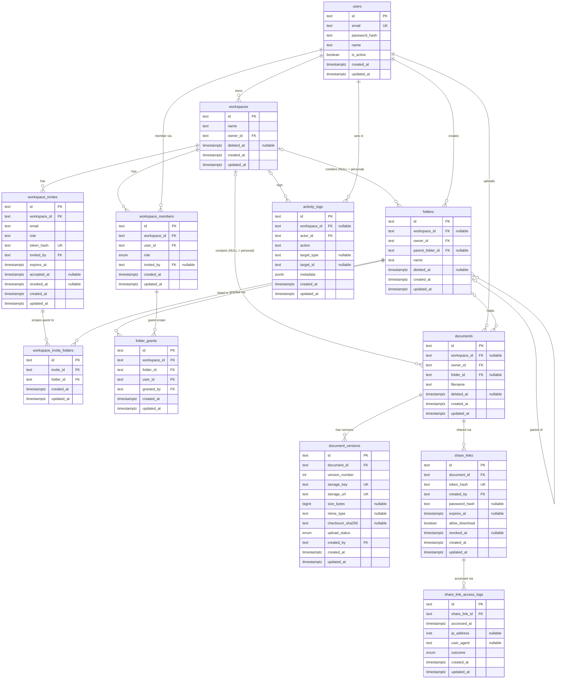

# 04 — Database Approach, Schema, Tables & Relationships

> Design of record for the PostgreSQL schema. Editable diagram: [docvault-erd.drawio](./docvault-erd.drawio), generated from the same table list as this document. The design is implemented as SQLAlchemy models in `backend/app/models/`; the first migration is created from them with `alembic revision --autogenerate`. There is no separate DDL file.

## Implementation status (first migration)

The SQLAlchemy models (`backend/app/models/`) are what `alembic revision --autogenerate` sees, so they hold everything Alembic can create on its own.

| In the models / first migration | Designed here, planned as a follow-up hand-written revision |
|---|---|
| All 12 tables, both mixins, enums stored as VARCHAR + named CHECK constraints (`workspace_role`, `upload_status`, `share_access_outcome`) | Deferred exactly-one-owner trigger (the unique index allowing at most one owner **is** in the models) |
| Every foreign key, including the composite ones (the schema has no circular foreign keys) | Folder parent-scope / cycle trigger; document-folder scope trigger; folder-grant and invite-folder triggers |
| Unique constraints, partial unique indexes (one owner per workspace, no duplicate pending invite, sibling folder names with `NULLS NOT DISTINCT`), CHECK constraints, plain indexes | Append-only triggers on `document_versions`, `share_link_access_logs`, `activity_logs` |
| Case-insensitive unique email via an index on `lower(email)` | Row-Level Security policies, helper functions and the `docvault_app` role |
| | `SECURITY DEFINER` functions (login lookup, share-link resolution); `pg_trgm` filename index |

Until the follow-up lands, the application must enforce the planned rules itself in `api/deps.py` and the service layer.

Model-driven adjustments to the earlier design, so that plain autogenerate produces a correct migration (revision files are never edited by hand): ids are generated in Python (no database function); `email` is `text` with a unique `lower(email)` index (no `citext`); enums are VARCHAR + CHECK, because native enum types are never dropped by an autogenerated downgrade and break when shared by two tables; `workspace_invites.role` is text + CHECK since it excludes `owner`; `documents` has no `current_version_id`, because Alembic silently drops a circular foreign key from `create_table` (the newest version is the current one); and the trigram index is deferred.

## Approach

- **Single shared PostgreSQL database**, not database-per-tenant or schema-per-tenant — the right trade-off at this scale (no banking/healthcare-grade regulatory driver), avoiding the operational cost of per-tenant migrations and provisioning.
- **`workspace_id` as the tenant-scoping column** on every workspace-owned table, filtered on every query at the application layer.
- **PostgreSQL Row-Level Security (RLS)** **planned** on every workspace-owned table as a database-enforced backstop (designed here; not in the first migration), so a bug or missing filter in application code fails closed instead of leaking another tenant's rows. The current user's ID is set via `SET LOCAL app.current_user_id` at the start of each request's transaction; RLS policies read it via `current_setting(...)`.
- **All schema changes go through Alembic migrations** — no manual DDL against a running database, ever.
- **Soft deletion** for workspaces, folders and documents (a nullable `deleted_at`, not a hard `DELETE`), so accidental removal is recoverable within a grace period. `deleted_at` replaces the earlier `is_deleted` flag: one column is both the flag and the grace-period clock.
- **Secrets are stored hashed.** Invite and share-link tokens keep only a SHA-256 hash (`token_hash`); the raw ≥128-bit token exists only in the emailed/shared URL.

## Base mixins — inherited by every table

Every table gets both mixins. They are two SQLAlchemy mixins in `backend/app/db/base.py` that every model inherits.

**RandomIdMixin — random primary key.** `id varchar(12) PRIMARY KEY`, default generated in Python by the mixin.
- 12 characters, base62 (`0-9A-Za-z`), **first character always a letter** (52 × 62¹¹ ≈ 3 × 10²¹ keys). Examples: `Ada6zQ8mfUFL`, `zjvsx3fDXshK`.
- Generated **in Python** by the mixin (`app.core.ids.generate_random_id`, `secrets` CSPRNG), like a Django random-id mixin. No database function or extension is involved, so plain `alembic revision --autogenerate` produces a complete migration. There is no collision-retry loop: a collision would surface as a primary-key violation, which at this key size is a practical impossibility. Inserts made outside the app must supply an `id`.
- All foreign-key columns are therefore `varchar(12)`.
- Composite-key tables from the original PRD (`workspace_members`, `workspace_invite_folders`) also get the random `id`; their former composite key is now a `UNIQUE` constraint.
- Random IDs stop enumeration and information leakage. They are **not** an access control: authorization stays in `api/deps.py` plus RLS, and share/invite tokens remain separate ≥128-bit secrets.

**TimestampMixin.** `created_at` and `updated_at` (`timestamptz NOT NULL`, server default `now()`; `updated_at` also has an ORM `onupdate=now()`). The two append-only log tables keep the columns for uniformity, but `updated_at` never changes.

```python
# Implemented in backend/app/db/base.py
class RandomIdMixin:
    id: Mapped[str] = mapped_column(String(12), primary_key=True, default=generate_random_id)

class TimestampMixin:
    created_at: Mapped[datetime] = mapped_column(DateTime(timezone=True), server_default=func.now())
    updated_at: Mapped[datetime] = mapped_column(DateTime(timezone=True), server_default=func.now(), onupdate=func.now())
```

## Entity-relationship diagram

Every table below also has `id` (PK), `created_at`, `updated_at` from the mixins. Foreign keys to `users` for `created_by` / `invited_by` / `granted_by` are listed in the table details but not drawn, to keep the diagram readable.



## Tables at a glance

| Group | Table | Purpose |
|---|---|---|
| Identity | `users` | Account identity and credentials |
| Tenancy | `workspaces` | A tenant / team |
| Tenancy | `workspace_members` | Who belongs to a workspace and at what role |
| Tenancy | `workspace_invites` | Pending invitations by email (FR-18) |
| Tenancy | `workspace_invite_folders` ➕ | Folders a Guest invite will be granted on acceptance (FR-21) |
| Content | `folders` | Folder hierarchy, personal or workspace-scoped (FR-22) |
| Content | `folder_grants` | Scopes a Guest to specific folders (FR-21) |
| Content | `documents` | One row per logical document (metadata only) |
| Content | `document_versions` | Append-only version history (FR-8) |
| Sharing | `share_links` | External, token-based access to exactly one document (FR-10…15) |
| Sharing | `share_link_access_logs` | Append-only audit trail of link usage (FR-14) |
| Sharing | `activity_logs` | Workspace audit trail (FR-29, FR-30) |

➕ = table added beyond the original PRD.

## Table details

### Identity

#### `users`

Account identity and credentials. Never hard-deleted (deactivate instead) so owner_id / created_by history survives.

| Column | Type | Nullable | Keys | Notes |
|---|---|:---:|---|---|
| `id` | text | no | PK | RandomIdMixin — generated in Python (app.core.ids): 12-char base62, letter first |
| `email` | text | no | UK | unique via an index on lower(email): case-insensitive, no citext extension; the app lower-cases on write |
| `password_hash` | text | no | — | Argon2 (FR-2) |
| `name` | text | no | — | 1–200 chars |
| `is_active` | boolean | no | — | default true; deactivation instead of delete |
| `created_at` | timestamptz | no | — | TimestampMixin — server default now() |
| `updated_at` | timestamptz | no | — | TimestampMixin — server default now(); ORM onupdate now() |

- **Planned follow-up:** RLS: a user sees themself and people who share a workspace with them; anyone may register (pre-auth insert).

### Tenancy

#### `workspaces`

A tenant / team. Soft-deleted first; a purge job (later) hard-deletes after a grace period.

| Column | Type | Nullable | Keys | Notes |
|---|---|:---:|---|---|
| `id` | text | no | PK | RandomIdMixin — generated in Python (app.core.ids): 12-char base62, letter first |
| `name` | text | no | — | 1–200 chars |
| `owner_id` | text | no | FK | → users.id; should equal the owner-role member (deferred trigger planned) |
| `deleted_at` | timestamptz | yes | — | soft delete |
| `created_at` | timestamptz | no | — | TimestampMixin — server default now() |
| `updated_at` | timestamptz | no | — | TimestampMixin — server default now(); ORM onupdate now() |

- Index: owner_id.

#### `workspace_members`

Who belongs to a workspace and at what role. Deleting the row is the whole revocation mechanism (FR-19).

| Column | Type | Nullable | Keys | Notes |
|---|---|:---:|---|---|
| `id` | text | no | PK | RandomIdMixin — generated in Python (app.core.ids): 12-char base62, letter first |
| `workspace_id` | text | no | FK | → workspaces.id, ON DELETE CASCADE; UNIQUE (workspace_id, user_id) |
| `user_id` | text | no | FK | → users.id |
| `role` | enum | no | — | owner \| admin \| member \| guest (VARCHAR + CHECK, not a native enum type) |
| `invited_by` | text | yes | FK | → users.id |
| `created_at` | timestamptz | no | — | TimestampMixin — server default now() |
| `updated_at` | timestamptz | no | — | TimestampMixin — server default now(); ORM onupdate now() |

- Partial unique index (workspace_id) WHERE role='owner' → at most one owner.
- **Planned follow-up:** Deferred constraint trigger → exactly one owner at commit, and it equals workspaces.owner_id (FR-20). Transfer = demote + promote in one transaction.
- Index: user_id ("which workspaces am I in", FR-17).

#### `workspace_invites`

Pending invitations by email (FR-18). Only the token hash is stored.

| Column | Type | Nullable | Keys | Notes |
|---|---|:---:|---|---|
| `id` | text | no | PK | RandomIdMixin — generated in Python (app.core.ids): 12-char base62, letter first |
| `workspace_id` | text | no | FK | → workspaces.id, ON DELETE CASCADE |
| `email` | text | no | — | invitee (may not have an account yet); the app lower-cases on write |
| `role` | text | no | — | admin \| member \| guest via CHECK (never owner) |
| `token_hash` | text | no | UK | sha256 hex |
| `invited_by` | text | no | FK | → users.id |
| `expires_at` | timestamptz | no | — |  |
| `accepted_at` | timestamptz | yes | — | added |
| `revoked_at` | timestamptz | yes | — | added |
| `created_at` | timestamptz | no | — | TimestampMixin — server default now() |
| `updated_at` | timestamptz | no | — | TimestampMixin — server default now(); ORM onupdate now() |

- Partial unique (workspace_id, email) WHERE accepted_at IS NULL AND revoked_at IS NULL → no duplicate pending invite.

#### `workspace_invite_folders` ➕

Folders a Guest invite will be granted on acceptance (FR-21). Without it a guest invite cannot carry its scope.

| Column | Type | Nullable | Keys | Notes |
|---|---|:---:|---|---|
| `id` | text | no | PK | RandomIdMixin — generated in Python (app.core.ids): 12-char base62, letter first |
| `invite_id` | text | no | FK | → workspace_invites.id, ON DELETE CASCADE |
| `folder_id` | text | no | FK | → folders.id, ON DELETE CASCADE; UNIQUE (invite_id, folder_id) |
| `created_at` | timestamptz | no | — | TimestampMixin — server default now() |
| `updated_at` | timestamptz | no | — | TimestampMixin — server default now(); ORM onupdate now() |

- **Planned follow-up:** Trigger: invite role must be guest and the folder must belong to the invite's workspace.

### Content

#### `folders`

Folder hierarchy, personal or workspace-scoped (FR-22). Deleting a folder relocates/flags its documents (FR-23).

| Column | Type | Nullable | Keys | Notes |
|---|---|:---:|---|---|
| `id` | text | no | PK | RandomIdMixin — generated in Python (app.core.ids): 12-char base62, letter first |
| `workspace_id` | text | yes | FK | → workspaces.id; NULL = personal folder |
| `owner_id` | text | no | FK | → users.id; creator, and the access owner when personal |
| `parent_folder_id` | text | yes | FK | → folders.id; NULL = root |
| `name` | text | no | — | 1–255 chars, no / or \ |
| `deleted_at` | timestamptz | yes | — | soft delete |
| `created_at` | timestamptz | no | — | TimestampMixin — server default now() |
| `updated_at` | timestamptz | no | — | TimestampMixin — server default now(); ORM onupdate now() |

- UNIQUE (id, workspace_id) — target for the composite FK from folder_grants.
- Unique sibling name, case-insensitive, live rows only (NULLS NOT DISTINCT), separately for workspace and personal scope.
- **Planned follow-up:** Trigger: parent must be in the same scope (same workspace, or same owner when personal); cycles rejected.
- Indexes: (workspace_id, parent_folder_id), parent_folder_id, owner_id WHERE personal.

#### `folder_grants`

Scopes a Guest to specific folders (FR-21). A grant covers the folder and all descendants. Deleting the row revokes access.

| Column | Type | Nullable | Keys | Notes |
|---|---|:---:|---|---|
| `id` | text | no | PK | RandomIdMixin — generated in Python (app.core.ids): 12-char base62, letter first |
| `workspace_id` | text | no | FK | added; part of both composite FKs below |
| `folder_id` | text | no | FK | → folders (id, workspace_id), ON DELETE CASCADE |
| `user_id` | text | no | FK | → workspace_members (workspace_id, user_id), ON DELETE CASCADE |
| `granted_by` | text | no | FK | → users.id |
| `created_at` | timestamptz | no | — | TimestampMixin — server default now() |
| `updated_at` | timestamptz | no | — | TimestampMixin — server default now(); ORM onupdate now() |

- UNIQUE (folder_id, user_id).
- Removing a membership cascades to its grants in the same statement → immediate revocation (FR-19).
- **Planned follow-up:** Trigger: grantee must be a guest; grantor must be owner/admin of that workspace.

#### `documents`

One row per logical document (metadata only). The file bytes live in object storage, addressed by document_versions.storage_key.

| Column | Type | Nullable | Keys | Notes |
|---|---|:---:|---|---|
| `id` | text | no | PK | RandomIdMixin — generated in Python (app.core.ids): 12-char base62, letter first |
| `workspace_id` | text | yes | FK | → workspaces.id; NULL = personal document |
| `owner_id` | text | no | FK | → users.id; uploader, and the access owner when personal |
| `folder_id` | text | yes | FK | → folders.id; NULL = root |
| `filename` | text | no | — | 1–255 chars, no / or \ |
| `deleted_at` | timestamptz | yes | — | soft delete + grace-period clock (replaces is_deleted, FR-7) |
| `created_at` | timestamptz | no | — | TimestampMixin — server default now() |
| `updated_at` | timestamptz | no | — | TimestampMixin — server default now(); ORM onupdate now() |

- storage_key is NOT on this table (PRD duplicated it): the active file is the latest version's (highest version_number). There is no current_version_id: it would make documents <-> document_versions circular, which Alembic autogenerate cannot create.
- **Planned follow-up:** Trigger: folder must be in the same scope; personal document ⇒ personal folder of the same owner.
- Indexes: (workspace_id, folder_id) WHERE deleted_at IS NULL; owner_id WHERE personal; folder_id; btree on lower(filename) (trigram index planned with FR-24).

#### `document_versions`

Append-only version history (FR-8). Re-uploading adds a row, never overwrites.

| Column | Type | Nullable | Keys | Notes |
|---|---|:---:|---|---|
| `id` | text | no | PK | RandomIdMixin — generated in Python (app.core.ids): 12-char base62, letter first |
| `document_id` | text | no | FK | → documents.id |
| `version_number` | int | no | — | > 0; UNIQUE (document_id, version_number) |
| `storage_key` | text | no | UK | opaque, server-generated (FR-6) |
| `storage_url` | text | no | UK | full S3 object URL, e.g. https://<endpoint>/<bucket>/<storage_key>; the object address only, not a download link (bucket stays private; clients get pre-signed URLs) |
| `size_bytes` | bigint | yes | — | added; filled at finalise |
| `mime_type` | text | yes | — | added |
| `checksum_sha256` | text | yes | — | added; 64 hex chars |
| `upload_status` | enum | no | — | added; pending \| ready \| rejected (FR-9); shareable only when ready |
| `created_by` | text | no | FK | → users.id |
| `created_at` | timestamptz | no | — | TimestampMixin — server default now() |
| `updated_at` | timestamptz | no | — | TimestampMixin — server default now(); ORM onupdate now() |

- The current version is the row with the highest version_number; UNIQUE (document_id, version_number) makes that an index lookup.
- **Planned follow-up:** Trigger: no DELETE; identity columns immutable; a finalised version cannot change. The app role gets UPDATE only on the four finalise columns.

### Sharing

#### `share_links`

External, token-based access to exactly one document (FR-10…15). Revocation is a flag so access logs stay attributable.

| Column | Type | Nullable | Keys | Notes |
|---|---|:---:|---|---|
| `id` | text | no | PK | RandomIdMixin — generated in Python (app.core.ids): 12-char base62, letter first |
| `document_id` | text | no | FK | → documents.id |
| `token_hash` | text | no | UK | sha256 of a ≥128-bit random token |
| `created_by` | text | no | FK | → users.id |
| `password_hash` | text | yes | — | optional per-link password |
| `expires_at` | timestamptz | yes | — | optional expiry |
| `allow_download` | boolean | no | — | added; default true (FR-12) |
| `revoked_at` | timestamptz | yes | — | checked on every access, never cached (FR-13) |
| `created_at` | timestamptz | no | — | TimestampMixin — server default now() |
| `updated_at` | timestamptz | no | — | TimestampMixin — server default now(); ORM onupdate now() |

- **Planned follow-up:** Public resolution goes through the SECURITY DEFINER function app.resolve_share_link(token_hash); it returns only this one link's data (FR-15).

#### `share_link_access_logs`

Append-only audit trail of link usage (FR-14).

| Column | Type | Nullable | Keys | Notes |
|---|---|:---:|---|---|
| `id` | text | no | PK | RandomIdMixin — generated in Python (app.core.ids): 12-char base62, letter first |
| `share_link_id` | text | no | FK | → share_links.id |
| `accessed_at` | timestamptz | no | — |  |
| `ip_address` | inet | yes | — |  |
| `user_agent` | text | yes | — | added |
| `outcome` | enum | no | — | added; ok \| bad_password \| expired \| revoked |
| `created_at` | timestamptz | no | — | TimestampMixin — server default now() |
| `updated_at` | timestamptz | no | — | TimestampMixin — never changes (append-only table) |

- Index: (share_link_id, accessed_at DESC).
- **Planned follow-up:** Append-only trigger; written via app.log_share_access().

#### `activity_logs`

Workspace audit trail (FR-29, FR-30). Append-only.

| Column | Type | Nullable | Keys | Notes |
|---|---|:---:|---|---|
| `id` | text | no | PK | RandomIdMixin — generated in Python (app.core.ids): 12-char base62, letter first |
| `workspace_id` | text | yes | FK | → workspaces.id; NULL only for platform-level events |
| `actor_id` | text | no | FK | → users.id |
| `action` | text | no | — | from the action catalogue below |
| `target_type` | text | yes | — | added |
| `target_id` | text | yes | — | added |
| `metadata` | jsonb | no | — | default {} |
| `created_at` | timestamptz | no | — | TimestampMixin — server default now() |
| `updated_at` | timestamptz | no | — | TimestampMixin — never changes (append-only table) |

- Index: (workspace_id, created_at DESC).
- **Planned follow-up:** Append-only trigger; the app role has SELECT + INSERT only.

## Key relationship rules enforced by the schema

- A document's access path is exactly one of: **owned personally** (`workspace_id NULL`, `owner_id` = you) or **workspace-scoped** (`workspace_id` set, checked against `workspace_members`) — never both, never neither. A trigger also forces a document's folder into the same scope.
- The current version of a document is its `document_versions` row with the highest `version_number` (versions are append-only, and `UNIQUE (document_id, version_number)` makes the lookup an index scan). There is deliberately no back-reference column on `documents`: it would make `documents` and `document_versions` circular, and Alembic autogenerate cannot create a circular foreign key. Restoring an old version means copying it as a new version.
- A workspace must have exactly one `owner`-role row in `workspace_members` at all times, and it must equal `workspaces.owner_id` — a partial unique index (at most one) plus a deferred constraint trigger (never zero, checked at commit), not just convention. Ownership transfer is demote + promote in one transaction.
- A folder grant can only be given to a **guest**, by an **owner/admin**, on a folder of the **same workspace**. Removing the membership removes its grants in the same statement (`ON DELETE CASCADE`).
- Folders cannot form cycles, and a folder's parent must be in the same scope.
- `document_versions`, `share_link_access_logs` and `activity_logs` are append-only (triggers, plus least-privilege grants for the application role).

## Foreign-key delete actions

| Rule | Where |
|---|---|
| `RESTRICT` (default) | Everything not listed below. Users are never deleted; workspaces are soft-deleted first, and hard deletion is a later purge job, not an FK cascade. |
| `CASCADE` | `workspace_members.workspace_id`; `workspace_invites.workspace_id`; `workspace_invite_folders.invite_id / folder_id`; `folder_grants.folder_id` and `(workspace_id, user_id)` (revocation on member removal). |

## Row-Level Security (planned follow-up, not in the first migration)

- The API connects as the non-owner role `docvault_app`. RLS is **enabled** on every table below but not `FORCE`d: the `SECURITY DEFINER` helper functions are owned by the table owner and must bypass RLS to avoid infinite policy recursion (e.g. `workspace_members`' own policy needs `workspace_members`). Consequence: **never run the API as the table owner.**
- Every request runs `SET LOCAL app.current_user_id = '<user id>'`; policies compare against `app.current_user_id()`. With it unset, nothing matches.
- Helpers: `app.workspace_role(ws)`, `app.is_workspace_admin(ws)`, `app.can_read_workspace_item(ws, folder)` (guests only via a grant on the folder **or any ancestor**), `app.can_write_scope`, `app.can_read_document / can_write_document`, `app.shares_workspace_with`.
- Deliberate non-RLS paths (no current user exists yet), each a narrow `SECURITY DEFINER` function: `app.find_user_for_login(email)`, `app.resolve_share_link(token_hash)` (returns only that link's data — FR-15) and `app.log_share_access(...)`. Accepting an invite will be added the same way with the membership FRs.

| Table | Read | Write |
|---|---|---|
| `users` | self, or shares a workspace | self update; open insert (registration) |
| `workspaces` | creator or any member | insert as owner; update owner/admin; delete owner |
| `workspace_members` | own row, or owner/admin/member of that workspace (guests cannot list members) | owner; admin (never touching the owner row); creator bootstrap of the first owner row; anyone may remove themself |
| `workspace_invites`, `workspace_invite_folders` | owner/admin | owner/admin |
| `folders`, `documents` | personal: owner; workspace: member or above, guests via granted folders | personal: owner; workspace: owner/admin/member |
| `folder_grants` | the guest themself, or owner/admin | owner/admin |
| `document_versions` | as the parent document | as the parent document (update only the four finalise columns) |
| `share_links` | anyone who can write the document | same (never guests) |
| `share_link_access_logs` | whoever manages the link | via `app.log_share_access()` only |
| `activity_logs` | owner/admin | any member, only as themself (insert only) |

## Activity action catalogue (FR-29)

`workspace.created`, `workspace.deleted`, `member.invited`, `member.joined`, `member.removed`, `member.role_changed`, `ownership.transferred`, `guest.folder_granted`, `guest.folder_revoked`, `invite.revoked`. `target_type` / `target_id` identify the affected row; `metadata` holds before/after values (e.g. `{"from":"member","to":"admin"}`).

## Functional-requirement coverage

| FR | Where it lives |
|---|---|
| FR-1 | `users` (email + password). **Email-verification state is not stored** — `email_verified_at` and `auth_tokens` were removed by decision; see "Open items" |
| FR-2 | `users.password_hash` |
| FR-3 | No schema impact (stateless JWT) |
| FR-4 | **Not stored in the schema** (`auth_tokens` removed by decision); see "Open items" |
| FR-5, FR-6 | `documents` with `workspace_id NULL`; `document_versions.storage_key`, `size_bytes` |
| FR-7 | `documents.deleted_at` (soft delete + grace clock) |
| FR-8 | `document_versions` (append-only) |
| FR-9 | `document_versions.mime_type`, `checksum_sha256`, `upload_status` |
| FR-10 | `share_links.token_hash` |
| FR-11, FR-15 | Look up by `share_links.token_hash`; planned `app.resolve_share_link()` (no account, one document only) |
| FR-12 | `share_links.password_hash`, `expires_at`, `allow_download` |
| FR-13 | `share_links.revoked_at` |
| FR-14 | `share_link_access_logs` |
| FR-16 | `workspaces`, `workspace_members` (owner row) |
| FR-17 | `workspace_members (user_id)` index, `folder_grants` |
| FR-18 | `workspace_invites` |
| FR-19 | `workspace_members` delete + cascade to `folder_grants` |
| FR-20 | one-owner unique index (in the models) + deferred constraint trigger (planned) |
| FR-21 | `folder_grants`, `workspace_invite_folders` |
| FR-22 | `folders.parent_folder_id` |
| FR-23 | `folders.deleted_at`; `documents.folder_id` is `RESTRICT` |
| FR-24 | `lower(filename)` btree index (trigram planned); `owner_id`, `folder_id` indexes |
| FR-25, FR-26, FR-28 | No schema impact |
| FR-27 | Derived: personal (`workspace_id IS NULL`), workspace-shared, publicly shared (`share_links` not revoked/expired) |
| FR-29, FR-30 | `activity_logs` |

## Changes vs. the original PRD

Everything here is an addition or correction beyond the first version of this document, listed so it can be reviewed:

1. **Primary keys**: UUID → random 12-char base62 text (`RandomIdMixin`); every table has `created_at` / `updated_at` (`TimestampMixin`). `workspace_members` and the new `workspace_invite_folders` get an `id`; the old composite key is a unique constraint.
2. **New table**: `workspace_invite_folders` (guest invites need their folder scope — FR-21).
3. **`users`**: `email_verified` bool **removed** (no `email_verified_at` either, by decision); added `is_active`. No `auth_tokens` table, by decision.
4. **Soft delete**: `workspaces.deleted_at`, `folders.deleted_at`; `documents.is_deleted` → `deleted_at`.
5. **`documents`**: `storage_key` removed (the active file is the latest version's); `current_version_id` removed as well (the highest `version_number` is current), so there is no circular foreign key.
6. **`document_versions`**: added `storage_url` (full S3 object URL, kept alongside `storage_key`), `size_bytes`, `mime_type`, `checksum_sha256`, `upload_status` (FR-9).
7. **Tokens hashed**: `workspace_invites.token`, `share_links.token` → `token_hash`.
8. **`workspace_invites`**: added `accepted_at`, `revoked_at`, `invited_by`; duplicate pending invites blocked by a partial unique index.
9. **`workspace_members`**: added `invited_by`. **`folder_grants`**: added `workspace_id` (composite FKs), and a grant now covers descendants.
10. **`share_links`**: added `allow_download` (FR-12). **`share_link_access_logs`**: added `user_agent`, `outcome`. **`activity_logs`**: added `target_type`, `target_id`.
11. **Integrity beyond the PRD**: exactly-one-owner made concrete (unique index now, deferred trigger planned); folder scope/cycle triggers, append-only triggers and least-privilege grants for `docvault_app` are planned.

## Open items (need a decision before the auth FRs)

- **FR-1 (verify email) and FR-4 (password reset)** have no persistence now: the `auth_tokens` table and `users.email_verified_at` were removed by decision. Either implement them with **stateless signed, expiring tokens** (no table; but "single-use" cannot be enforced, and there is no record of who is verified), or amend FR-1/FR-4 in `07-functional-requirements.md` to drop them, or re-add the table later.
- **`document_versions.storage_url`** is the object's address (`https://<endpoint>/<bucket>/<storage_key>`), not a download link: the bucket is private and clients only ever receive short-lived pre-signed URLs minted from `storage_key` after the authorization check. Never return `storage_url` to a client. It embeds the bucket endpoint, so changing endpoint/bucket means a data migration; `storage_key` stays the portable identifier.

Related: [05-role-model.md](./05-role-model.md) for what `role` values mean, [06-permission-matrix.md](./06-permission-matrix.md) for how these tables get checked on every request, [docvault-erd.drawio](./docvault-erd.drawio) for the editable diagram.
