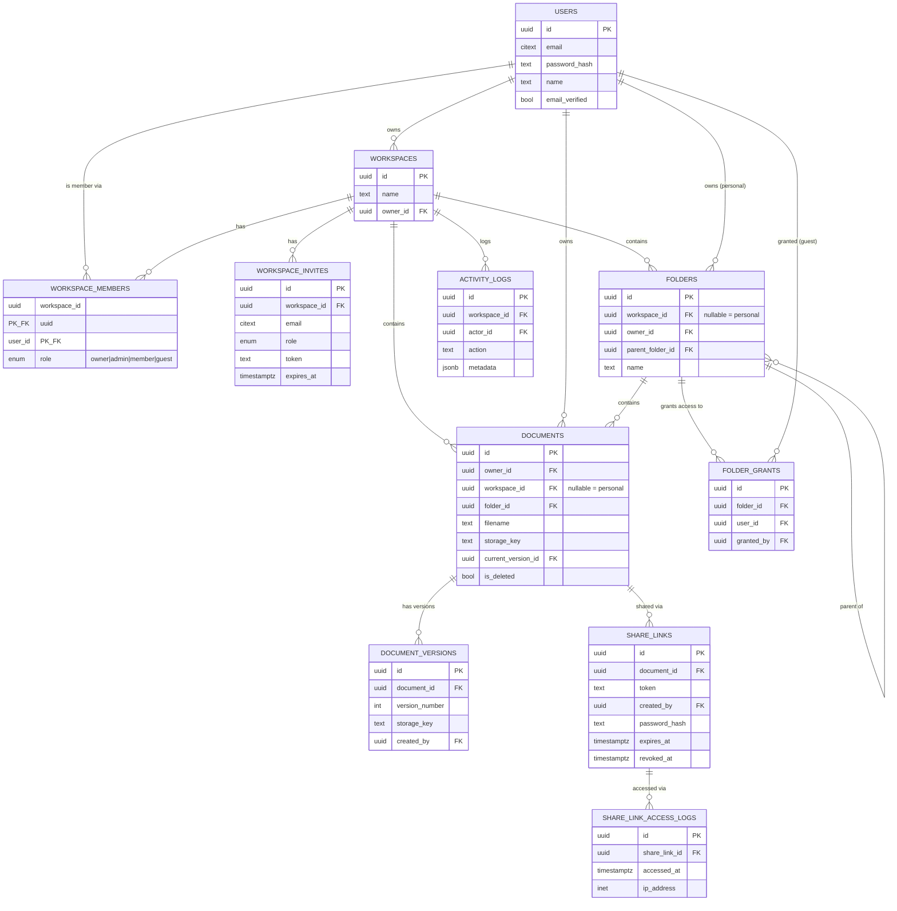

# 04 — Database Approach, Schema, Tables & Relationships

## Approach

- **Single shared PostgreSQL database**, not database-per-tenant or schema-per-tenant — the right trade-off at this scale (no banking/healthcare-grade regulatory driver), avoiding the operational cost of per-tenant migrations and provisioning.
- **`workspace_id` as the tenant-scoping column** on every workspace-owned table, filtered on every query at the application layer.
- **PostgreSQL Row-Level Security (RLS)** enabled on every workspace-owned table as a database-enforced backstop, so a bug or missing filter in application code fails closed instead of leaking another tenant's rows. The current user's ID is set via `SET LOCAL` at the start of each request's transaction; RLS policies read it via `current_setting(...)`.
- **All schema changes go through Alembic migrations** — no manual DDL against a running database, ever.
- **Soft deletion** for documents and folders (a `is_deleted`/`deleted_at` flag, not a hard `DELETE`), so accidental removal is recoverable within a grace period.

## Entity-relationship diagram

## Table summary

| Table | Purpose | Notes on deletion / membership handling |
|---|---|---|
| `users` | Account identity, credentials | Never hard-deleted in v1 (deactivation flag preferred over removal, to preserve `owner_id`/`created_by` history) |
| `workspaces` | A tenant/team | Owner transfer required before an Owner can leave; deleting cascades to members/folders/documents (soft-delete recommended over hard cascade in production) |
| `workspace_members` | Who belongs to a workspace, and at what role | Composite PK `(workspace_id, user_id)`; row deletion = immediate access revocation |
| `workspace_invites` | Pending invitations | Unique partial index prevents duplicate pending invites to the same email; expires automatically |
| `folders` | Organizational hierarchy | `workspace_id NULL` = personal folder; deleting a folder relocates or flags its documents, never silently deletes them |
| `folder_grants` | Guest-role scoping to specific folders | Deleting the grant is the entire revocation mechanism for a Guest's access to that folder |
| `documents` | File metadata, one row per logical document | Soft-deleted (`is_deleted`/`deleted_at`); `current_version_id` always points at the active version |
| `document_versions` | Version history | Append-only; never deleted when a document gets a new version |
| `share_links` | External, token-based access to one document | Revocation is a flag (`revoked_at`), not a delete, so access logs remain attributable |
| `share_link_access_logs` | Audit trail for link usage | Append-only |
| `activity_logs` | Workspace-level audit trail | Append-only; `workspace_id` nullable only for platform-level events, if any exist later |

## Key relationship rules enforced by the schema

- A document's access path is exactly one of: **owned personally** (`workspace_id NULL`, `owner_id` = you) or **workspace-scoped** (`workspace_id` set, checked against `workspace_members`) — never both, never neither.
- `documents.current_version_id` is a forward reference into `document_versions`, added via `ALTER TABLE ... ADD CONSTRAINT` after both tables exist, since the two tables reference each other.
- A workspace must have exactly one `owner`-role row in `workspace_members` at all times (enforced via constraint/trigger, not just convention).

Related: [05-role-model.md](./05-role-model.md) for what `role` values mean, [06-permission-matrix.md](./06-permission-matrix.md) for how these tables get checked on every request, `docvault-erd.drawio` (in the repo's `docs/` or diagrams folder) for the visual ERD, `001_init_schema.sql` / the Alembic migration for the literal DDL.
