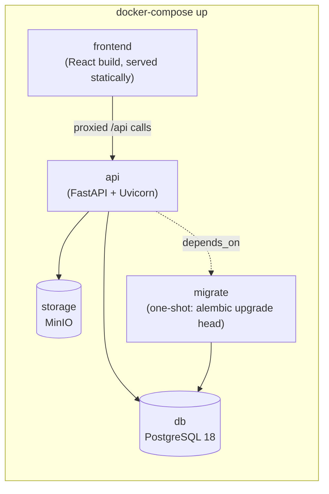

# 08 — Deployment

## `docker-compose` services

- **`db`** — PostgreSQL 18, named volume for data persistence, healthcheck gating dependent services.
- **`storage`** — MinIO, named volume for object data, console port exposed only in local/dev compose overrides (never in a production-facing compose file); bucket auto-created on first boot via an init step.
- **`migrate`** — one-shot container running `alembic upgrade head`; `api` has `depends_on: migrate: { condition: service_completed_successfully }`.
- **`api`** — FastAPI/Uvicorn; environment-configured DB DSN, MinIO/S3 credentials and endpoint, JWT secret, upload size limit; never bakes secrets into the image.
- **`frontend`** — built React app served by a lightweight static server (or Nginx), proxying `/api/*` to the `api` service in dev; in production this tier can instead be a CDN/static host pointing at the same API.

## Configuration

- A single `.env.example` at the repo root documents every required variable (`DATABASE_URL`, `S3_ENDPOINT_URL`, `S3_ACCESS_KEY`, `S3_SECRET_KEY`, `S3_BUCKET`, `JWT_SECRET`, `MAX_UPLOAD_MB`, `FRONTEND_URL`) — `docker-compose up` should work from a copy of this file with no manual edits for local dev.
- The `StorageBackend` abstraction (see [03-architecture.md](./03-architecture.md)) is selected by a single env var (`STORAGE_BACKEND=s3|local`), so swapping MinIO for local disk (or real S3) in another environment is a config change, not a code change.

## Environments

- **Local dev**: full `docker-compose up`, MinIO console exposed for inspection, hot-reload for both API (`--reload`) and frontend (Vite dev server).
- **CI**: same compose file (or a slimmed test-only variant) spun up for integration tests; `pytest` runs against a real Postgres + MinIO, not mocks, for the authorization-critical test set (see [09-project-structure.md](./09-project-structure.md) `backend/tests/`).
- **Production**: same images, no `--reload`, real TLS termination in front, managed Postgres and S3-compatible storage acceptable as drop-in replacements for the `db`/`storage` containers since nothing in the app is coupled to running them in Docker specifically.

Related: [02-tech-stack.md](./02-tech-stack.md) for exact versions of everything running in these containers.
