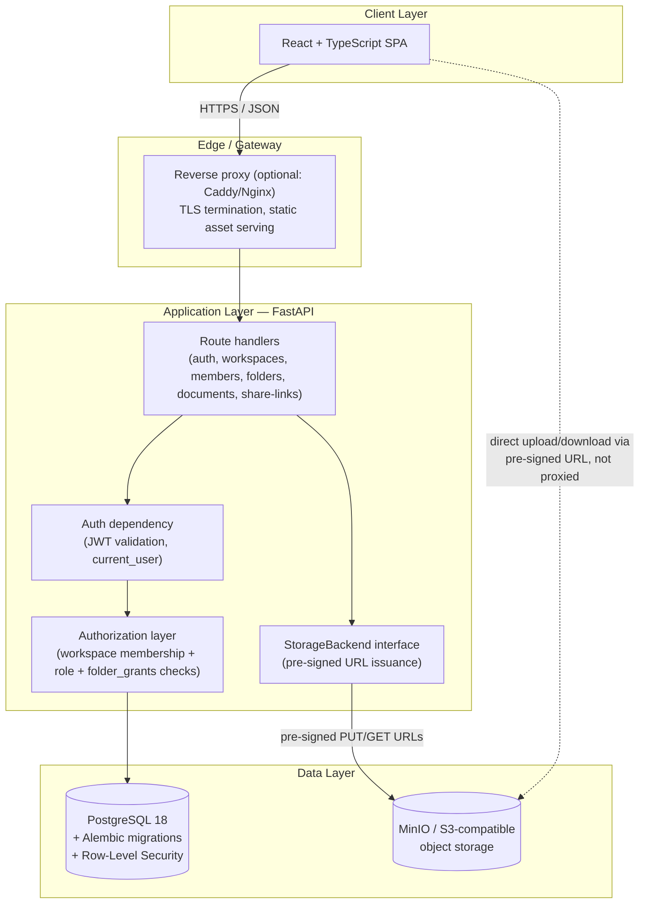
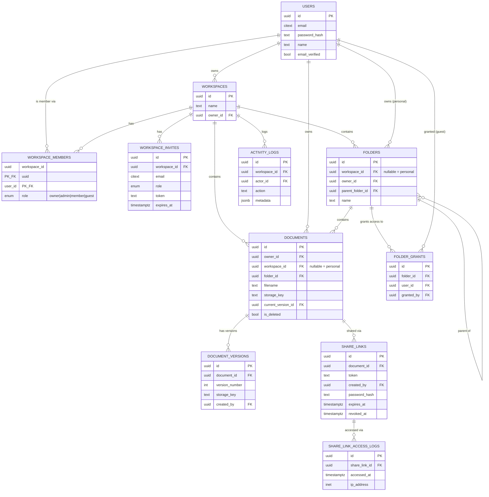
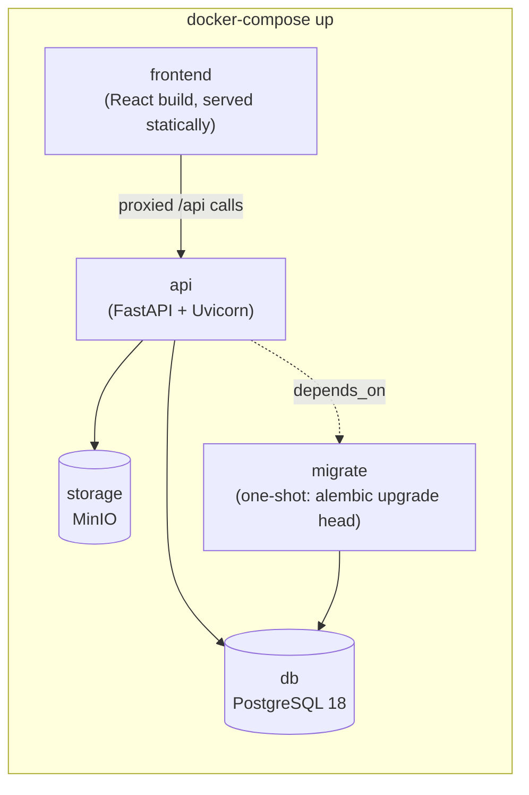

# DocVault — Product & Technical Specification

*Consolidated reference: objective, stack, architecture, data model, roles, permissions, functional requirements, deployment, and project structure. Supersedes fragments discussed earlier in this thread — this is the single document to hand to a team starting the build.*

---

## 1. Project Objective

**DocVault** is a multi-tenant document workspace platform for any team or organization. It replaces the ad-hoc pattern of emailing attachments and re-sharing personal-drive folders with three guarantees:

1. **Safe, durable storage** for a user's own documents.
2. **Controlled external sharing** — a single document, via an unguessable, revocable link, to someone outside the organization, without exposing anything else.
3. **Isolated team workspaces** — an organization creates a workspace, invites its own people, organizes documents there, and is guaranteed that no other organization on the platform can see it. A logged-in user sees only the workspaces they created or were explicitly added to — nothing else exists for them.

The product succeeds if a small team can stop passing files around one at a time and instead trust one shared, access-controlled home for their documents — and if that trust holds even as the platform serves many unrelated organizations at once.

---

## 2. Technology Stack (stable versions)

| Layer | Choice | Stable version (pin at build time) |
|---|---|---|
| Language (backend) | Python | 3.12.x (3.13 acceptable if all deps confirmed compatible) |
| Backend framework | FastAPI | 0.136.x |
| ASGI server | Uvicorn | 0.34.x |
| Data validation | Pydantic | 2.x (v2 line, ships with FastAPI) |
| ORM | SQLAlchemy | 2.x (async engine) |
| Migrations | Alembic | 1.14.x |
| Database | PostgreSQL | 18.x (17.x is an acceptable fallback if a managed provider hasn't caught up) |
| Object storage | MinIO (S3-compatible) | latest stable `RELEASE` image locally; any S3-compatible provider in production via the same client |
| Storage SDK | `boto3` / `aioboto3` | latest stable, S3-compatible API only (no AWS-specific features used) |
| Auth | JWT (`python-jose` or `pyjwt`) + `passlib[argon2]` | latest stable |
| Frontend language | TypeScript | 5.x |
| Frontend framework | React | 19.2.x |
| Frontend build tool | Vite | 6.x |
| Frontend HTTP client | native `fetch` or `axios` | latest stable |
| Package manager (frontend) | pnpm or npm | Node 22.x LTS (Maintenance) or 24.x LTS (Active) as the runtime |
| Containerization | Docker + Docker Compose | Compose v2 (`docker compose`, not the standalone v1 binary) |
| Testing (backend) | pytest + httpx (async test client) | latest stable |
| Testing (frontend) | Vitest + React Testing Library | latest stable |

**Constraint compliance check** (against the earlier stated constraints): Python ✅, PostgreSQL with migrations (Alembic) ✅, storage kept out of Postgres and behind an S3-compatible abstraction (MinIO swappable for real S3/local disk) ✅, React + TypeScript UI ✅, FastAPI backend ✅, single `docker-compose up` bring-up ✅.

---

## 3. Architecture

### 3.1 Diagram



### 3.2 Layer explanations

**Client layer (React + TypeScript).** A single-page app: login/signup, workspace switcher, folder browser, upload flow, member/role management, and the "share" dialog. Talks to the API only over JSON; never talks to Postgres or MinIO directly except when using a pre-signed URL it was handed by the API (the browser still never sees storage credentials).

**Edge / gateway.** TLS termination and static file serving for the built frontend. Optional in local dev (Vite's dev server + FastAPI's CORS handling covers it), present in any real deployment.

**Application layer (FastAPI).** Split into three concerns that stay decoupled on purpose:
- *Auth dependency* — validates the JWT on every protected request and resolves `current_user`. This is the only place a request's identity is established.
- *Authorization layer* — a shared dependency, not duplicated per-route, that answers "does `current_user` have the right relationship to this `workspace_id`/`document_id`/`folder_id`?" by checking `workspace_members` (role) and, for Guests, `folder_grants`. Every document/folder/workspace route goes through this before touching data — see §5 for why this single-path design matters for security review.
- *Route handlers* — thin; they call the authorization layer, then read/write through SQLAlchemy, and for file operations ask the `StorageBackend` interface for a pre-signed URL rather than touching bytes themselves.

**Data layer.**
- *PostgreSQL* holds every piece of metadata: users, workspaces, membership, roles, folders, document metadata/versions, share links, access logs, activity logs. Schema changes only ever happen through Alembic migrations. Row-Level Security policies back the application-level `workspace_id` filtering as a database-enforced backstop (§4.4).
- *MinIO/S3* holds only file bytes, addressed by opaque storage keys the application controls. It is not reachable from the browser or the public internet directly — only the FastAPI backend holds storage credentials, and clients get short-lived pre-signed URLs for the specific object they're authorized to touch.

**Why uploads/downloads bypass the API for the actual bytes:** the backend issues a pre-signed URL (after running the authorization check) and the browser talks to MinIO/S3 directly for the PUT/GET. This keeps large files off the API server's memory/bandwidth entirely, while the backend still controls *which* object, *how long* the URL is valid, and *whether the request was authorized* at the moment the URL was minted.

---

## 4. Database Approach, Schema, Tables & Relationships

### 4.1 Approach

- **Single shared PostgreSQL database**, not database-per-tenant or schema-per-tenant — the right trade-off at this scale (no banking/healthcare-grade regulatory driver), avoiding the operational cost of per-tenant migrations and provisioning.
- **`workspace_id` as the tenant-scoping column** on every workspace-owned table, filtered on every query at the application layer.
- **PostgreSQL Row-Level Security (RLS)** enabled on every workspace-owned table as a database-enforced backstop, so a bug or missing filter in application code fails closed instead of leaking another tenant's rows. The current user's ID is set via `SET LOCAL` at the start of each request's transaction; RLS policies read it via `current_setting(...)`.
- **All schema changes go through Alembic migrations** — no manual DDL against a running database, ever.
- **Soft deletion** for documents and folders (a `is_deleted`/`deleted_at` flag, not a hard `DELETE`), so accidental removal is recoverable within a grace period.

### 4.2 Entity-relationship diagram



### 4.3 Table summary

| Table | Purpose | Notes on deletion / membership handling |
|---|---|---|
| `users` | Account identity, credentials | Never hard-deleted in v1 (deactivation flag preferred over removal, to preserve `owner_id`/`created_by` history) |
| `workspaces` | A tenant/team | Owner transfer required before an Owner can leave; deleting cascades to members/folders/documents (soft-delete recommended over hard cascade in production) |
| `workspace_members` | Who belongs to a workspace, and at what role | Composite PK `(workspace_id, user_id)`; row deletion = immediate access revocation |
| `workspace_invites` | Pending invitations | Unique partial index prevents duplicate pending invites to the same email; expires automatically |
| `folders` | Organizational hierarchy | `workspace_id NULL` = personal folder; deleting a folder relocates or flags its documents, never silently deletes them |
| `folder_grants` | Guest-role scoping to specific folders | Deleting the grant is the entire revocation mechanism for a Guest's access to that folder |
| `documents` | File metadata, one row per logical document | Soft-deleted (`is_deleted`/`deleted_at`); `current_version_id` always points at the active version |
| `document_versions` | Version history | Append-only; never deleted when a document gets a new version |
| `share_links` | External, token-based access to one document | Revocation is a flag (`revoked_at`), not a delete, so access logs remain attributable |
| `share_link_access_logs` | Audit trail for link usage | Append-only |
| `activity_logs` | Workspace-level audit trail | Append-only; `workspace_id` nullable only for platform-level events, if any exist later |

### 4.4 Key relationship rules enforced by the schema

- A document's access path is exactly one of: **owned personally** (`workspace_id NULL`, `owner_id` = you) or **workspace-scoped** (`workspace_id` set, checked against `workspace_members`) — never both, never neither.
- `documents.current_version_id` is a forward reference into `document_versions`, added via `ALTER TABLE ... ADD CONSTRAINT` after both tables exist, since the two tables reference each other.
- A workspace must have exactly one `owner`-role row in `workspace_members` at all times (enforced via constraint/trigger, not just convention).

---

## 5. Role Model

Roles are scoped **per workspace** — a user's role is local to each workspace they belong to, not a global account attribute.

| Role | Description | Assigned via |
|---|---|---|
| **Owner** | Ultimate accountability for the workspace — usually its creator | Automatically on workspace creation; transferable to an existing Admin, never zero |
| **Admin** | Manages members, roles (below Owner), and workspace-wide structure | Invited directly as Admin, or promoted by an existing Admin/Owner |
| **Member** | Regular team user — uploads, organizes, shares what they can access | Default role on invite acceptance |
| **Guest** | External or limited collaborator restricted to specific granted folders | Invited as Guest, scoped via `folder_grants` |

Why four roles rather than a generic permissions system: this set matches the actual decisions the product needs to make (who's accountable, who administers, who's a full member, who's a scoped-in outsider) without building a general-purpose permissions matrix the requirements don't call for yet. The schema is additive-friendly if that changes later (see §7 of the earlier PRD discussion — custom roles/per-resource ACLs stay a deliberate non-goal for v1).

---

## 6. Permission Model Matrix

| Action | Guest | Member | Admin | Owner |
|---|:---:|:---:|:---:|:---:|
| View documents in granted folders | ✅ | ✅ | ✅ | ✅ |
| Browse entire workspace | ❌ | ✅ | ✅ | ✅ |
| Upload / edit documents | ❌ | ✅ | ✅ | ✅ |
| Create folders | ❌ | ✅ | ✅ | ✅ |
| Create external share links | ❌ | ✅ (docs they can access) | ✅ | ✅ |
| See workspace member list | ❌ | ✅ | ✅ | ✅ |
| Invite members / guests | ❌ | ❌ | ✅ | ✅ |
| Grant/revoke guest folder access | ❌ | ❌ | ✅ | ✅ |
| Change member roles | ❌ | ❌ | ✅ (not Owner) | ✅ |
| Remove members | ❌ | ❌ | ✅ (not Owner) | ✅ |
| View activity/audit log | ❌ | ❌ | ✅ | ✅ |
| Manage workspace settings | ❌ | ❌ | ✅ | ✅ |
| Transfer ownership | ❌ | ❌ | ❌ | ✅ |
| Delete workspace | ❌ | ❌ | ❌ | ✅ |

Personal (non-workspace) documents sit outside this matrix entirely — access is just "are you the owner," independent of any workspace role.

---

## 7. Functional Requirements

### 7.1 Authentication & Accounts
- FR-1: Register with email + password; verify email before full access.
- FR-2: Passwords hashed with Argon2 (via `passlib`), never stored or logged in plaintext.
- FR-3: JWT-based auth on every protected route; short-lived access tokens.
- FR-4: Password reset flow via emailed, single-use, expiring token.

### 7.2 Personal Document Storage
- FR-5: Upload a document (configurable size cap, default 100 MB) to a personal (non-workspace) space.
- FR-6: Files stored in MinIO/S3 addressed by an internal storage key — never a client-supplied path.
- FR-7: Owner can rename, move, download, or soft-delete their own documents; soft-deleted documents are recoverable within a grace period.
- FR-8: Re-uploading creates a new version (`document_versions`), not a silent overwrite.
- FR-9: Basic MIME-type/content validation on upload before a file becomes shareable.

### 7.3 External Sharing via Link
- FR-10: Generate a share link for a single document, with a cryptographically random (≥128-bit) token.
- FR-11: No account required to open a share link.
- FR-12: Optional per-link password, expiry date, and allow/deny download.
- FR-13: Owner/editor can revoke a link at any time; revocation is checked on every access, not cached.
- FR-14: Link access is logged (timestamp, IP) and viewable by the document's owner.
- FR-15: The public share endpoint returns only the one document's data — never folder contents or other workspace metadata.

### 7.4 Workspaces & Membership
- FR-16: Any authenticated user can create a workspace and becomes its Owner.
- FR-17: `GET /workspaces` returns only workspaces where the current user has a `workspace_members` row (owner/admin/member) or a `folder_grants`-implied guest presence — nothing else is visible or discoverable.
- FR-18: Admins/Owners invite by email with a chosen role; invitees without an account sign up first, then accept.
- FR-19: Removing a member immediately revokes their access to all workspace documents and folders.
- FR-20: A workspace always has exactly one Owner; last-Owner removal/demotion is blocked until ownership is transferred.
- FR-21: Guests are invited scoped to specific folders (`folder_grants`) and see only those folders.

### 7.5 Folders & Organization
- FR-22: Create/rename/move/delete folders, nested via `parent_folder_id`.
- FR-23: Deleting a folder relocates or flags its documents rather than deleting them.
- FR-24: Search/filter documents by filename, uploader, or folder.

### 7.6 API + Web UI
- FR-25: FastAPI REST API covering auth, workspaces, members, folders, documents, share-links, activity log — OpenAPI docs enabled in dev.
- FR-26: React + TypeScript UI: login/signup, workspace switcher (role shown per workspace), folder browser, upload flow, member/role management, share dialog.
- FR-27: The UI visually distinguishes "private to me," "shared within workspace," and "shared publicly via link" on every document.
- FR-28: `docker-compose up` brings up the full stack — API, Postgres, MinIO, frontend — including running pending Alembic migrations automatically.

### 7.7 Auditability
- FR-29: Role changes, membership changes, ownership transfers, and guest folder-grant changes are recorded in `activity_logs`.
- FR-30: Admins/Owners can view a workspace's activity feed.

---

## 8. Deployment

### 8.1 `docker-compose` services



- **`db`** — PostgreSQL 18, named volume for data persistence, healthcheck gating dependent services.
- **`storage`** — MinIO, named volume for object data, console port exposed only in local/dev compose overrides (never in a production-facing compose file); bucket auto-created on first boot via an init step.
- **`migrate`** — one-shot container running `alembic upgrade head`; `api` has `depends_on: migrate: { condition: service_completed_successfully }`.
- **`api`** — FastAPI/Uvicorn; environment-configured DB DSN, MinIO/S3 credentials and endpoint, JWT secret, upload size limit; never bakes secrets into the image.
- **`frontend`** — built React app served by a lightweight static server (or Nginx), proxying `/api/*` to the `api` service in dev; in production this tier can instead be a CDN/static host pointing at the same API.

### 8.2 Configuration
- A single `.env.example` at the repo root documents every required variable (`DATABASE_URL`, `S3_ENDPOINT_URL`, `S3_ACCESS_KEY`, `S3_SECRET_KEY`, `S3_BUCKET`, `JWT_SECRET`, `MAX_UPLOAD_MB`, `FRONTEND_URL`) — `docker-compose up` should work from a copy of this file with no manual edits for local dev.
- The `StorageBackend` abstraction is selected by a single env var (`STORAGE_BACKEND=s3|local`), so swapping MinIO for local disk (or real S3) in another environment is a config change, not a code change.

### 8.3 Environments
- **Local dev**: full `docker-compose up`, MinIO console exposed for inspection, hot-reload for both API (`--reload`) and frontend (Vite dev server).
- **CI**: same compose file (or a slimmed test-only variant) spun up for integration tests; `pytest` runs against a real Postgres + MinIO, not mocks, for the authorization-critical test set (§9 of the earlier discussion).
- **Production**: same images, no `--reload`, real TLS termination in front, managed Postgres and S3-compatible storage acceptable as drop-in replacements for the `db`/`storage` containers since nothing in the app is coupled to running them in Docker specifically.

---

## 9. Project Structure

```
docvault/
├── docker-compose.yml
├── docker-compose.override.yml.example
├── .env.example
├── README.md
│
├── backend/
│   ├── Dockerfile
│   ├── pyproject.toml
│   ├── alembic.ini
│   ├── alembic/
│   │   ├── env.py
│   │   └── versions/
│   │       └── 001_init_schema.py
│   ├── app/
│   │   ├── main.py                  # FastAPI app instantiation
│   │   ├── config.py                # env-driven settings (pydantic-settings)
│   │   ├── db/
│   │   │   ├── session.py           # async SQLAlchemy engine/session
│   │   │   └── base.py              # declarative base, model registry
│   │   ├── models/                  # SQLAlchemy models, one file per table group
│   │   │   ├── user.py
│   │   │   ├── workspace.py
│   │   │   ├── folder.py
│   │   │   ├── document.py
│   │   │   ├── share_link.py
│   │   │   └── activity.py
│   │   ├── schemas/                 # Pydantic request/response models
│   │   ├── api/
│   │   │   ├── deps.py              # auth + authorization dependencies
│   │   │   └── routes/
│   │   │       ├── auth.py
│   │   │       ├── workspaces.py
│   │   │       ├── members.py
│   │   │       ├── folders.py
│   │   │       ├── documents.py
│   │   │       └── share_links.py
│   │   ├── storage/
│   │   │   ├── base.py              # StorageBackend protocol
│   │   │   ├── s3_backend.py        # MinIO/S3 implementation
│   │   │   └── local_backend.py     # local-disk implementation
│   │   └── core/
│   │       ├── security.py          # password hashing, JWT
│   │       └── logging.py
│   └── tests/
│       ├── test_cross_user_access.py
│       ├── test_share_link_scoping.py
│       ├── test_membership_removal.py
│       ├── test_deletion_semantics.py
│       └── test_storage_backends.py
│
├── frontend/
│   ├── Dockerfile
│   ├── package.json
│   ├── tsconfig.json
│   ├── vite.config.ts
│   ├── src/
│   │   ├── main.tsx
│   │   ├── App.tsx
│   │   ├── api/                     # typed API client
│   │   ├── pages/
│   │   │   ├── Login.tsx
│   │   │   ├── WorkspaceSwitcher.tsx
│   │   │   ├── FolderBrowser.tsx
│   │   │   ├── DocumentDetail.tsx
│   │   │   └── MemberManagement.tsx
│   │   ├── components/
│   │   └── types/
│   └── tests/
│
└── docs/
    ├── prd-multi-tenant-workspace-v2.md
    ├── api-specification.md
    └── team-doc-workspace-erd.drawio
```

**Structure notes:**
- `backend/app/api/deps.py` is deliberately the single place authorization logic lives — matches §3.2's architecture note that this must not be duplicated per-route.
- `backend/app/storage/` holds the `StorageBackend` interface and both implementations side by side, so the abstraction described in §2/§8.2 is visible in the file layout, not just in prose.
- `backend/tests/` file names map directly to the risk areas called out in the requirements discussion (cross-user access, share-link scoping, membership removal, deletion semantics) rather than being organized by route — a reviewer should be able to find "the test that would catch this" by risk area, not have to infer it from generic route-based test files.
