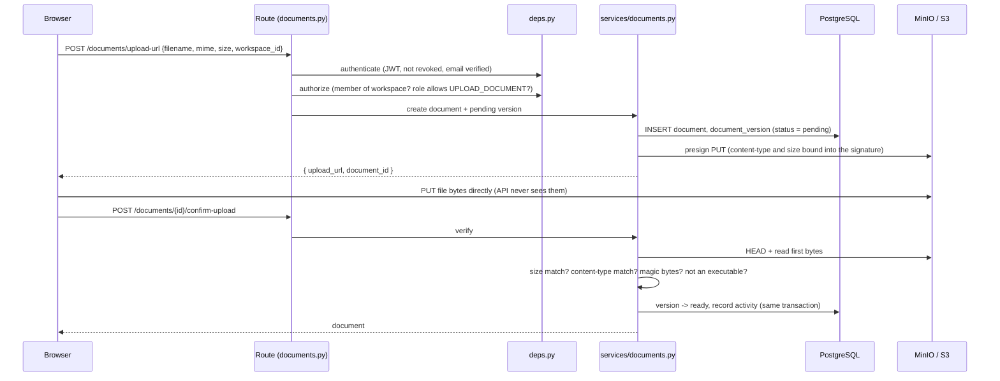

# DocVault — Process Flow

A guided walk through the codebase, in the order things happen: startup, the data layer, one request from browser to database and back, the authorization model, the sharing flows, and the background job. For what the product does, see [USER_GUIDE.md](USER_GUIDE.md); for the decisions behind it, see [README.md](README.md); for the full spec, see [PRD/](PRD/README.md).

## Contents

1. [Big picture](#1-big-picture)
2. [Startup: `docker compose up`](#2-startup-docker-compose-up)
3. [Backend entry point](#3-backend-entry-point)
4. [Data layer](#4-data-layer)
5. [Life of a request: uploading a document](#5-life-of-a-request-uploading-a-document)
6. [Authorization](#6-authorization)
7. [Sharing flows](#7-sharing-flows)
8. [Account flows](#8-account-flows)
9. [Background job](#9-background-job)
10. [Frontend](#10-frontend)
11. [Quality and how it was built](#11-quality-and-how-it-was-built)
12. [Suggested walkthrough order](#12-suggested-walkthrough-order)

---

## 1. Big picture

DocVault is a multi-tenant document vault. Teams work in **workspaces**; people hold one of four **roles** (Owner, Admin, Member, Guest); documents are **versioned**; a document can be shared outside the team by **link**; and every important change is recorded in an **audit log**.

**Stack:** FastAPI · SQLAlchemy 2 (async) · Alembic · PostgreSQL 18 · MinIO/S3 · React 19 · TypeScript · Vite · Docker Compose.

```
Browser (React SPA)
   │  JSON over HTTP                      │  file bytes (pre-signed URL)
   ▼                                      ▼
FastAPI  ──── SQLAlchemy (async) ───▶ PostgreSQL          MinIO / S3
   │                                                          ▲
   └──────── issues pre-signed URLs, inspects objects ────────┘
```

The API never receives file bytes. It authorizes the request, then hands the browser a short-lived pre-signed URL so the browser talks to storage directly.

## 2. Startup: `docker compose up`

Services start in dependency order (`docker-compose.yml`):

| Order | Service | What it does |
|---|---|---|
| 1 | `db` | PostgreSQL 18, healthchecked with `pg_isready` |
| 1 | `storage` | MinIO; its S3 API port (9000) is published because the browser uploads and downloads through pre-signed URLs |
| 2 | `storage-init` | One-shot: creates the bucket |
| 2 | `migrate` | One-shot: `alembic upgrade head` |
| 3 | `api` | FastAPI on :8000, starts after `migrate` and `storage-init` succeed |
| 3 | `purge` | Hourly housekeeping loop (see [§9](#9-background-job)) |
| 4 | `frontend` | Vite dev server on :5173, proxies `/api` to the API |

Two storage addresses are configured on purpose: `S3_ENDPOINT_URL` (how the API reaches storage inside Docker) and `S3_PUBLIC_ENDPOINT_URL` (what the browser can reach). A pre-signed URL is bound to the host it was signed for, so URLs are signed for the public address.

## 3. Backend entry point

[`backend/app/main.py`](backend/app/main.py) — `create_app()`:

1. Configures logging and registers the global error handlers (every error uses one JSON shape).
2. Adds CORS, allowing only the configured frontend URL.
3. Mounts `/health` at the root (compose and CI probe it).
4. Mounts the routers under `/api/v1`: `auth`, `workspaces`, `members`, `invites`, `activity`, `folders`, `documents`, `share_links`, `public`.

## 4. Data layer

- **Models** — [`backend/app/models/`](backend/app/models/): 14 tables, one module per area (`user`, `workspace`, `folder`, `document`, `share_link`, `activity`, `auth_token`, `revoked_token`). Every table has a random 12-character text id and `created_at` / `updated_at`.
- **ERD** — [`PRD/docvault-erd.drawio`](PRD/docvault-erd.drawio); the written schema is [`PRD/04-database-schema.md`](PRD/04-database-schema.md).
- **Migrations** — [`backend/alembic/`](backend/alembic/): the schema only changes through Alembic revisions, which are generated, never hand-written, and never edited once merged. The test setup runs `alembic check`, so a model change without a migration fails immediately.
- **Sessions** — [`backend/app/db/`](backend/app/db/): each request gets its own async session (one request = one transaction).

Key relationships:

```
users ─┬─< workspace_members >─┬─ workspaces ─┬─< folders ─< documents ─< document_versions
       │        (role)         │              │                  │
       │                       │              └─< workspace_invites ─< workspace_invite_documents
       │                       └─< document_grants (Guest access, per document)
       ├─< auth_tokens (verify email / reset password)
       ├─< revoked_tokens (logout)
       └─< activity_logs        documents ─< share_links ─< share_link_access_logs
```

## 5. Life of a request: uploading a document

The upload is a good end-to-end example because it touches every layer.



Step by step:

1. **Browser** — the page calls the typed client in `frontend/src/api/`.
2. **Route** — [`api/routes/documents.py`](backend/app/api/routes/documents.py) is thin: it declares its dependencies and calls a service.
3. **Authentication** — [`api/deps.py`](backend/app/api/deps.py): valid token, `jti` not in `revoked_tokens`, user exists, email verified.
4. **Authorization** — `get_workspace_access` (member of this workspace, else 404) then `require(Action.UPLOAD_DOCUMENT)` (role high enough, else 403). See [§6](#6-authorization).
5. **Service** — [`services/documents.py`](backend/app/services/documents.py) validates the request (filename, MIME type, size against the 100 MB limit) and creates the document and a `pending` version with a server-generated opaque storage key. The filename never becomes a storage path.
6. **Storage** — the `StorageBackend` interface ([`storage/`](backend/app/storage/)) produces a pre-signed upload URL (15 minutes). Storage credentials never leave the server.
7. **Direct upload** — the browser PUTs the bytes to MinIO.
8. **Confirm** — the API asks storage for the object's size and content type and reads its first bytes ([`services/upload_validation.py`](backend/app/services/upload_validation.py)): declared size must match, declared type must match, magic bytes must agree with the type, and executables (PE, ELF, Mach-O, shebang) are rejected outright. Only then is the version marked `ready`; otherwise it is `rejected` and the object is deleted.
9. **Audit** — `record_activity()` writes the audit row in the same transaction as the change, so they commit or roll back together.

Downloads and previews follow the same shape: authorize, then return a short-lived (5 minute) pre-signed URL. Previews use `Content-Disposition: inline`; downloads use `attachment`.

## 6. Authorization

Authorization lives in one place and is checked on every request.

| File | Role |
|---|---|
| [`core/permissions.py`](backend/app/core/permissions.py) | The permission matrix as data: role levels and the minimum level per action |
| [`api/deps.py`](backend/app/api/deps.py) | The only place role and membership checks are enforced; routes depend on it and never re-implement checks |
| [`services/access.py`](backend/app/services/access.py) | Resource-level visibility: Guest grants, personal documents, deleted items |

**Role levels:** Owner 4 · Admin 3 · Member 2 · Guest 1. An action needs a minimum level; `can(role, action)` is a single comparison.

| Role | Can |
|---|---|
| **Guest** | View and download documents granted to them individually. No folders, no uploads, no sharing, no member list |
| **Member** | Everything in the workspace: upload, rename, move, delete and restore documents; manage folders; create share links; see the member list |
| **Admin** | Member + invite, change roles, remove members, grant or revoke a Guest's documents, view the activity log. Never touches the Owner |
| **Owner** | Admin + transfer ownership, delete the workspace. Exactly one per workspace |

**The checks, in order, on every request:**

1. **Login** — valid, unrevoked token; verified email.
2. **Membership** — not a member → **404**, identical to "does not exist", so nobody can probe which workspaces or documents exist.
3. **Role** — member but the role is too low → **403**.
4. **Resource** — Guest without a grant, another user's personal document, a deleted item → **404**.
5. **Target** — acting on another member: the Owner can never be changed or removed by anyone else.

The frontend keeps a mirror of the role levels (`permissions/roleHierarchy.ts`) purely to hide or disable buttons, and a test asserts the two copies match. The backend is the only enforcement point.

## 7. Sharing flows

### Share link (no account needed)
- Created by a Member or above. The token is 256 random bits; only its SHA-256 hash is stored, so a database leak yields no working links.
- Options: optional password, optional expiry, and an allow-download toggle that can be changed after the link is created.
- Every open is logged (time, IP, outcome). A revoked or expired link is refused on the next request. Ten wrong passwords from one address lock that link for 15 minutes.
- The public endpoint returns only that one document, never folder contents or workspace data.

### Invite
- Sent by an Admin or Owner, tied to a role, single-use, expires after 7 days. Only the hash of the token is stored.
- A person without an account signs up first, then accepts, and lands in the workspace with the invited role. Only the invited email address can accept.

### Guest access
- Granted per document (`document_grants`), never per folder. A Guest invite carries the document ids to grant on acceptance.
- Grants are folder-pinned: moving a document to another folder, or deleting its folder, revokes them.
- Removing a member deletes their row and cascades their grants away immediately.

## 8. Account flows

- **Register** — Argon2 password hash; a verification email is sent. Until verified, a user can sign in but every route except `/auth/me` and resend returns `EMAIL_NOT_VERIFIED`.
- **Login** — returns an HS256 JWT (24 hours, carrying a random `jti`). A dummy hash is verified for unknown emails so response time does not reveal which accounts exist.
- **Logout** — stores the token's `jti` in `revoked_tokens`; every request checks it.
- **Forgot / reset password** — single-use, expiring token (hashed at rest); the forgot endpoint always answers the same way, so it never reveals which emails have accounts.
- **Email** — goes through a `Mailer` interface; each message is `multipart/alternative` (HTML from Jinja2 templates plus a plain-text fallback). With `SMTP_HOST` unset the mailer only logs the message, so links can be read from `docker compose logs api`.

## 9. Background job

[`backend/app/jobs/purge.py`](backend/app/jobs/purge.py) runs as the `purge` compose service: `python -m app.jobs.purge --every 3600`. It is a plain loop, not Celery — one hourly task does not justify a broker and worker.

Each run (logic in [`services/purge.py`](backend/app/services/purge.py)) removes:
- documents past their 30-day trash period, with their storage objects;
- abandoned uploads that were never confirmed;
- expired revoked-token rows.

A failed run is logged and the loop continues. It is designed for a single instance.

## 10. Frontend

[`frontend/src/`](frontend/src/):

| Folder | Role |
|---|---|
| `api/` | One typed client per backend resource; components never call `fetch` directly |
| `types/` | Mirrors the backend Pydantic schemas |
| `auth/` | Session context, route protection, the "confirm your email" notice |
| `workspace/` | Current workspace and the caller's role |
| `permissions/` | Client-side copy of the role levels (UI only) |
| `pages/` | Login, signup, workspace list, dashboard, members, activity, trash, accept-invite, and the public share page |
| `components/` | Sidebar, upload, share-link, versions, preview, invite and folder-picker modals |
| `hooks/` | Toasts, debounced search, and `useSafeAction` (uniform error handling) |

The UI hides actions the role cannot perform, but that is convenience only.

## 11. Quality and how it was built

- **Backend tests** — [`backend/tests/`](backend/tests/), named by risk area, run against a real PostgreSQL (a separate `_test` database, emptied between tests). Storage is an in-memory fake, and one file exercises the real S3 backend against MinIO. Every route has a cross-user or cross-workspace denial test.
- **Checks** — `ruff`, `mypy` (strict), and 141 frontend tests with lint and a type-checked build.
- **Process** — each feature was planned first, then implemented against the spec in [`PRD/`](PRD/README.md), then verified; the verified record for each is in [`plans/`](plans/README.md). The work was done with Claude Code; see the README for how.

## 12. Suggested walkthrough order

1. The big picture ([§1](#1-big-picture)).
2. `docker-compose.yml` ([§2](#2-startup-docker-compose-up)).
3. `main.py` ([§3](#3-backend-entry-point)).
4. Models and the ERD ([§4](#4-data-layer)).
5. Follow one upload through route, `deps.py`, `permissions.py`, `access.py` and the service ([§5](#5-life-of-a-request-uploading-a-document), [§6](#6-authorization)).
6. Share links and invites ([§7](#7-sharing-flows)).
7. The purge job ([§9](#9-background-job)).
8. The frontend ([§10](#10-frontend)).
9. The tests, and the README's "Assumptions and decisions" section.

Two questions to be ready for: why non-members get 404 rather than 403, and why file bytes never pass through the API.
